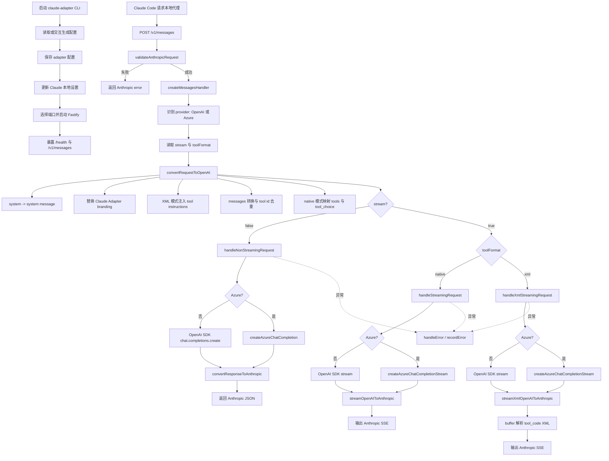

# Claude Adapter 执行流程分析

本文从代码入口出发，梳理 `claude-adapter` 的主要执行链路，并给出一份便于阅读的流程图。

## 项目定位

`claude-adapter` 是一个本地代理服务：

- 对外伪装成 Anthropic Messages API
- 对内把请求转成 OpenAI Chat Completions 风格
- 再把上游返回结果转换回 Anthropic 格式
- 支持普通响应、SSE 流式响应、工具调用，以及 Azure OpenAI v1 分支

核心入口与主路径：

- CLI 启动入口：`src/cli.ts:1`
- 服务创建：`src/server/index.ts:19`
- 主请求处理：`src/server/handlers.ts:36`
- 请求转换：`src/converters/request.ts:48`
- 非流式响应转换：`src/converters/response.ts:15`
- 原生工具流式转换：`src/converters/streaming.ts:65`
- XML 工具流式转换：`src/converters/xmlStreaming.ts:37`
- Azure 分支：`src/utils/azureOpenAI.ts:125`

## 一、启动阶段

CLI 从 `src/cli.ts:29` 开始执行，整体顺序如下：

1. 展示 banner 和标题。
2. 初始化 metadata。位置：`src/cli.ts:34`
3. 如果没有禁用 Claude settings，则更新本地 Claude 配置。位置：`src/cli.ts:37`
4. 加载已有配置；若不存在或指定 `--reconfigure`，则交互式询问：
   - 上游 `baseUrl`
   - `apiKey`
   - `opus / sonnet / haiku` 映射模型
   - 工具调用模式 `native` 或 `xml`
5. 选取可用端口。位置：`src/cli.ts:68`、`src/server/index.ts:78`
6. 创建并启动 Fastify 服务。位置：`src/cli.ts:71`、`src/server/index.ts:19`
7. 如果允许，回写 Claude Code 配置，使 Claude Code 请求流量指向本地代理。
8. 挂载 `SIGINT`，优雅关闭服务。位置：`src/cli.ts:104`

这一阶段的本质是：把 Claude Code 的上游地址改到本地 `claude-adapter`，让后续请求先进入本地代理。

## 二、服务启动后的路由结构

服务由 `createServer` 创建，位置：`src/server/index.ts:19`。

它只暴露两个关键接口：

- `GET /health`：健康检查，位置：`src/server/index.ts:35`
- `POST /v1/messages`：核心接口，位置：`src/server/index.ts:40`

同时还在 `onRequest` hook 中统一设置了 CORS，并处理 `OPTIONS` 预检请求。位置：`src/server/index.ts:23`

## 三、请求进入后的主处理链路

所有 Claude Code 的核心请求都会进入 `createMessagesHandler(config)`，位置：`src/server/handlers.ts:36`。

### 1. 识别 provider 分支

处理器初始化时会先判断 `baseUrl` 是否为 Azure OpenAI v1：

- 判断逻辑：`src/utils/provider.ts:10`
- 若不是 Azure，则创建标准 OpenAI SDK client：`src/server/handlers.ts:38`
- 若是 Azure，则后续走 `fetch` 封装的 Azure 请求路径

### 2. 请求校验

请求到达后先做 Anthropic 格式校验：`src/server/handlers.ts:52`

- 校验失败：直接构造 Anthropic 风格错误返回，位置：`src/server/handlers.ts:56`
- 校验成功：进入转换和转发流程

### 3. 提取关键上下文

处理器会取出：

- `model` 作为目标模型名：`src/server/handlers.ts:61`
- `stream` 判断是否流式：`src/server/handlers.ts:63`
- `config.toolFormat` 判断工具调用模式：`src/server/handlers.ts:74`

### 4. 把 Anthropic 请求转为 OpenAI 请求

核心转换函数：`convertRequestToOpenAI(...)`，位置：`src/converters/request.ts:48`

主要做了这些事情：

#### 4.1 system prompt 转换

Anthropic 的 `system` 被转成 OpenAI 的第一条 `system` message。位置：`src/converters/request.ts:55`

#### 4.2 Claude Code branding 替换

如果 system prompt 中识别到 Claude Code 的原始身份描述，会替换成 Claude Adapter branding。位置：`src/converters/request.ts:28`

这也是为什么这个代理可以在上游模型看来仍维持 Claude Code 交互语义，但把身份提示替换成适配器自己的说明。

#### 4.3 XML 模式下注入工具调用说明

如果配置为 `xml` 且请求中带 `tools`，则会把 XML 工具协议说明拼接进 system prompt。位置：`src/converters/request.ts:71`、`src/converters/xmlPrompt.ts:20`

这样做的目的，是在上游模型不支持原生 function calling 时，强制它输出如下格式：

```xml
<tool_code name="TOOL_NAME">
{"arg":"value"}
</tool_code>
```

#### 4.4 message 转换

Anthropic `messages` 会被逐条改写成 OpenAI `messages`。位置：`src/converters/request.ts:92`

这里包含几个重点：

- 普通 user/assistant 文本直接映射
- `tool_result` 会转成 OpenAI `tool` message：`src/converters/request.ts:310`
- `tool_use` 会转成 OpenAI `tool_calls`：`src/converters/request.ts:365`
- 对重复的 tool id 会进行去重修复，并建立映射关系：`src/converters/request.ts:367`

#### 4.5 assistant prefill 过滤

Anthropic 支持 assistant 预填内容，但很多 OpenAI 兼容服务不支持。代码会跳过一些典型 prefill 内容，比如 `{`、`[`、`<tool_code...`。位置：`src/converters/request.ts:148`

#### 4.6 max_tokens 特殊修正

若 Anthropic 请求里的 `max_tokens === 1`，会被提高到 `32`。位置：`src/converters/request.ts:97`

这是为了兼容 Azure 等上游对过小 token 限制更严格的情况。

#### 4.7 native 工具映射

如果是 `native` 模式，则会把 Anthropic `tools` 和 `tool_choice` 映射为 OpenAI 风格字段。位置：

- `src/converters/request.ts:134`
- `src/converters/tools.ts:8`
- `src/converters/tools.ts:22`

## 四、请求分支：非流式 / 流式

在 `src/server/handlers.ts:84` 开始，根据 `stream` 和 `toolFormat` 分流。

---

## 五、非流式路径

入口：`handleNonStreamingRequest(...)`，位置：`src/server/handlers.ts:110`

### 执行过程

1. 判断是否 Azure：`src/server/handlers.ts:119`
2. 非 Azure：调用 `openai.chat.completions.create({... stream:false })`：`src/server/handlers.ts:138`
3. Azure：调用 `createAzureChatCompletion(...)`：`src/server/handlers.ts:133`
4. 记录 usage：`src/server/handlers.ts:149`
5. 调用 `convertResponseToAnthropic(...)` 转回 Anthropic 格式：`src/server/handlers.ts:162`
6. 返回 JSON 给 Claude Code：`src/server/handlers.ts:163`

### 响应转换做了什么

`convertResponseToAnthropic` 位于 `src/converters/response.ts:15`，主要做：

- `message.content` -> `content[{ type: 'text' }]`
- `message.tool_calls` -> `content[{ type: 'tool_use' }]`
- `finish_reason` -> Anthropic `stop_reason`
- `usage.prompt_tokens / completion_tokens` -> Anthropic `usage`

因此，Claude Code 看到的依然是 Anthropic Messages API 响应结构。

---

## 六、流式路径：native 模式

入口：`handleStreamingRequest(...)`，位置：`src/server/handlers.ts:169`

### 上游请求

- 非 Azure：`openai.chat.completions.create({ stream:true })`：`src/server/handlers.ts:197`
- Azure：`createAzureChatCompletionStream(...)`：`src/server/handlers.ts:193`

### 下游转换

流式转换由 `streamOpenAIToAnthropic(...)` 完成，位置：`src/converters/streaming.ts:65`

它会把 OpenAI 的流式 chunk 翻译成 Anthropic SSE 事件，核心事件包括：

- `message_start`
- `content_block_start`
- `content_block_delta`
- `content_block_stop`
- `message_delta`
- `message_stop`

### native 工具流的关键点

当上游返回 `delta.tool_calls` 时，会：

1. 为每个 tool call 建立状态对象：`src/converters/streaming.ts:181`
2. 发送 `content_block_start(type=tool_use)`：`src/converters/streaming.ts:209`
3. 把 tool arguments 逐步转换为 `input_json_delta`：`src/converters/streaming.ts:219`
4. 完成时发送 `content_block_stop`

文本内容则被转成 `text_delta`。位置：`src/converters/streaming.ts:141`

最终在 `finishStream` 中：

- 记录 token usage：`src/converters/streaming.ts:306`
- 根据是否出现工具调用决定 `stop_reason` 是 `tool_use` 还是 `end_turn`
- 输出 `message_delta` 和 `message_stop`

---

## 七、流式路径：xml 模式

入口：`handleXmlStreamingRequest(...)`，位置：`src/server/handlers.ts:209`

这个模式适用于“上游模型不支持原生 function calling，但支持文本输出”的情况。

### 核心思路

上游模型不会返回 `tool_calls` 字段，而是被 system prompt 诱导输出 XML：

```xml
<tool_code name="Read">
{"file_path":"src/index.ts"}
</tool_code>
```

### XML 流转换器的工作方式

转换函数：`streamXmlOpenAIToAnthropic(...)`，位置：`src/converters/xmlStreaming.ts:37`

它不是直接按 token 实时映射工具调用，而是：

1. 持续缓存上游文本到 `buffer`：`src/converters/xmlStreaming.ts:113`
2. 从缓冲区中查找完整的 `<tool_code ...>...</tool_code>`：`src/converters/xmlStreaming.ts:126`
3. 找到完整 XML 后，拆成：
   - 前面的普通文本 -> Anthropic `text` block
   - XML 中的工具名和 JSON 参数 -> Anthropic `tool_use` block
4. 剩余文本继续留在 buffer 中等待后续 chunk
5. 结束时 flush 剩余文本：`src/converters/xmlStreaming.ts:156`

### 额外清洗逻辑

XML 模式还会：

- 去掉 `<think>...</think>` 块，避免污染工具解析：`src/converters/xmlStreaming.ts:27`
- 去掉嵌套 `<tool ...>` 包装：`src/converters/xmlStreaming.ts:168`
- 清洗参数内容后再作为 `input_json_delta` 发回 Claude Code

这条链路是整个项目里最“协议适配”味道最强的一段。

---

## 八、Azure OpenAI v1 特殊路径

Azure 分支的代码在：`src/utils/azureOpenAI.ts:125`

### 触发条件

`baseUrl` 满足 Azure v1 规则时启用：`src/utils/provider.ts:10`

### 与普通 OpenAI 路径的差异

1. 不使用 OpenAI SDK，而是直接 `fetch`：`src/utils/azureOpenAI.ts:63`
2. 使用 Azure 认证头：`api-key`：`src/utils/azureOpenAI.ts:25`
3. 请求地址固定拼成 `.../chat/completions`：`src/utils/azureOpenAI.ts:32`
4. 如果 Azure 因 `max_tokens` / `max_completion_tokens` 字段不兼容而返回 400，会自动切换字段后重试一次：
   - 识别逻辑：`src/utils/provider.ts:57`
   - 重试逻辑：`src/utils/azureOpenAI.ts:70`

因此，Azure 支路本质上是“传输层不同，但上层转换逻辑相同”。

## 九、错误处理与日志

统一错误出口在 `handleError(...)`，位置：`src/server/handlers.ts:249`

会做几件事：

- 尝试读取上游错误状态码
- 记录日志
- 记录错误文件：`src/server/handlers.ts:265`
- 转成 Anthropic 风格错误结构后返回

也就是说，不管上游是 OpenAI、Azure，还是 XML 流解析报错，最终都尽量以 Anthropic 错误格式回给 Claude Code。

## 十、主执行流程图



## 十一、可以把这个项目理解成什么

如果用一句话概括，这个项目的主逻辑就是：

**把 Claude Code 发来的 Anthropic Messages 请求，翻译成 OpenAI 兼容请求发给上游模型，再把上游返回结果翻译回 Claude Code 能继续消费的 Anthropic 协议。**

它的真正核心价值不在于“起一个 HTTP 服务”，而在于三层适配：

1. **协议适配**：Anthropic ↔ OpenAI
2. **工具适配**：native function calling ↔ XML tool calling
3. **Provider 适配**：标准 OpenAI 兼容接口 ↔ Azure OpenAI v1

如果你愿意，我下一步可以继续帮你补一版“按源码文件划分的模块关系图”，或者单独再画一张“`/v1/messages` 的时序图”。
